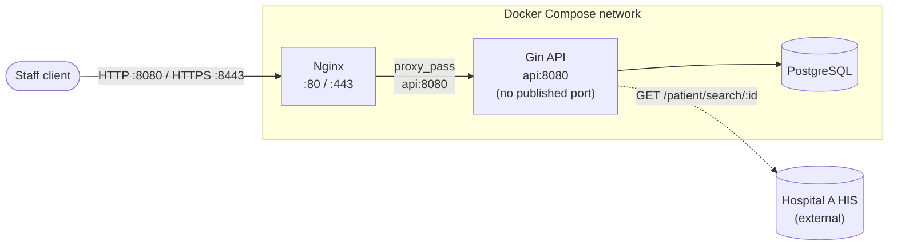
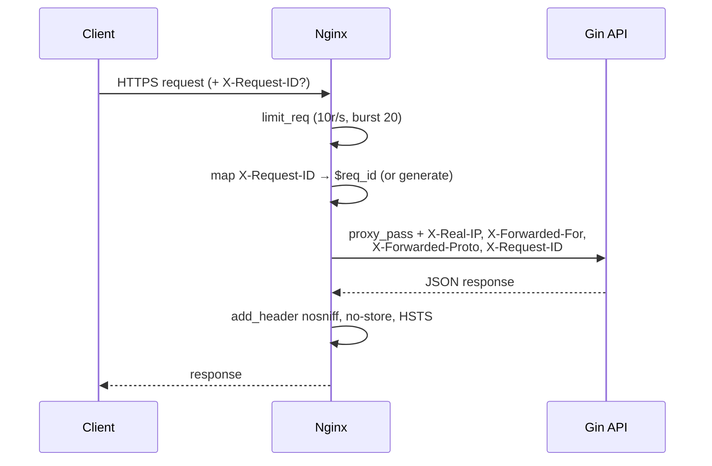

# Nginx — Edge Proxy

Nginx is the public edge for this stack. The Go API is never published on a host
port — it's only reachable through Nginx on the Compose internal network. Config
lives in [`nginx/`](nginx): [`nginx.conf`](nginx/nginx.conf) (main) +
[`snippets/proxy.conf`](nginx/snippets/proxy.conf) (shared proxy/location rules,
included by both the HTTP and TLS server blocks).

## Topology



## Request lifecycle



## What Nginx is responsible for

| Concern | Directive(s) | Detail |
|---|---|---|
| TLS termination | `ssl_certificate` / `ssl_certificate_key` (443 server) | Self-signed cert, local assessment only — see [TLS](#tls-local-self-signed) |
| Rate limiting | `limit_req_zone` / `limit_req` | 10 req/s per IP, burst 20, `nodelay` |
| Body size cap | `client_max_body_size 1m` | Blocks oversized requests at the edge |
| Header forwarding | `proxy_set_header` | `X-Real-IP`, `X-Forwarded-For`, `X-Forwarded-Proto`, `X-Request-ID` |
| Request correlation | `map` + custom `log_format main` | Reuses inbound `X-Request-ID` or generates `$request_id`; logged as `req_id=` |
| Security response headers | `add_header ... always` | `X-Content-Type-Options: nosniff`, `Cache-Control: no-store`, `Strict-Transport-Security` |
| Health routing | `location /healthz` | Proxied, unauthenticated, `access_log off` |
| Version hiding | `server_tokens off` | No Nginx version in `Server` header / error pages |
| Timeouts | `proxy_connect/send/read_timeout` | 5s / 30s / 30s to the upstream |

Application-level concerns (auth, per-hospital scoping, per-staff-id rate limits,
JWT) live in the Go service — Nginx only does edge-level defense in depth.

## TLS (local, self-signed)

TLS terminates at Nginx. Since this is a local assessment stack with no real
domain, `make certs` (run automatically by `make setup`) generates a self-signed
cert into `nginx/certs/` (gitignored — never commit it):

```bash
make setup   # creates the Postgres volume + generates nginx/certs/server.{crt,key}
make up      # docker compose up -d --build
```

| Port | Protocol | Env var |
|---|---|---|
| `8080` (host) → `80` (container) | HTTP | `NGINX_PORT` |
| `8443` (host) → `443` (container) | HTTPS (self-signed) | `NGINX_TLS_PORT` |

```bash
curl http://localhost:8080/healthz
curl -k https://localhost:8443/healthz   # -k: skip self-signed cert verification
```

There is **no automatic HTTP→HTTPS redirect** — Compose maps both ports to
non-standard host ports, so a same-host `301` would resolve to the wrong port.
Rationale and production follow-up are recorded in
[`docs/knowledge-base/decisions.md`](docs/knowledge-base/decisions.md) (D-012).

## Config map

```
nginx/
├── nginx.conf            # http block, rate limit zone, upstream, 2 server blocks (80, 443)
├── snippets/
│   └── proxy.conf         # shared: /healthz + / location rules, included by both server blocks
└── certs/                 # gitignored — generated by `make certs`
    ├── server.crt
    └── server.key
```

## Related docs

- [`docs/knowledge-base/architecture_overview.md`](docs/knowledge-base/architecture_overview.md) — runtime topology
- [`docs/knowledge-base/security_rules.md`](docs/knowledge-base/security_rules.md) §9 — transport/header rules Nginx must satisfy
- [`docs/knowledge-base/observability_and_ops.md`](docs/knowledge-base/observability_and_ops.md) §11 — Compose service contract
- [`docs/knowledge-base/decisions.md`](docs/knowledge-base/decisions.md) D-012 — TLS decision
