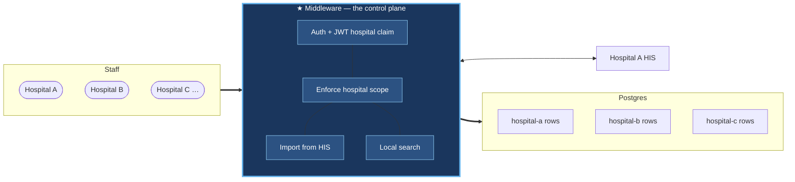
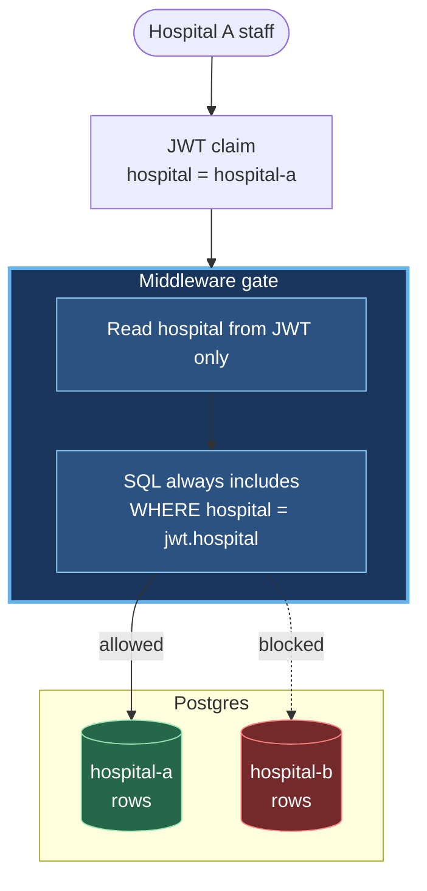
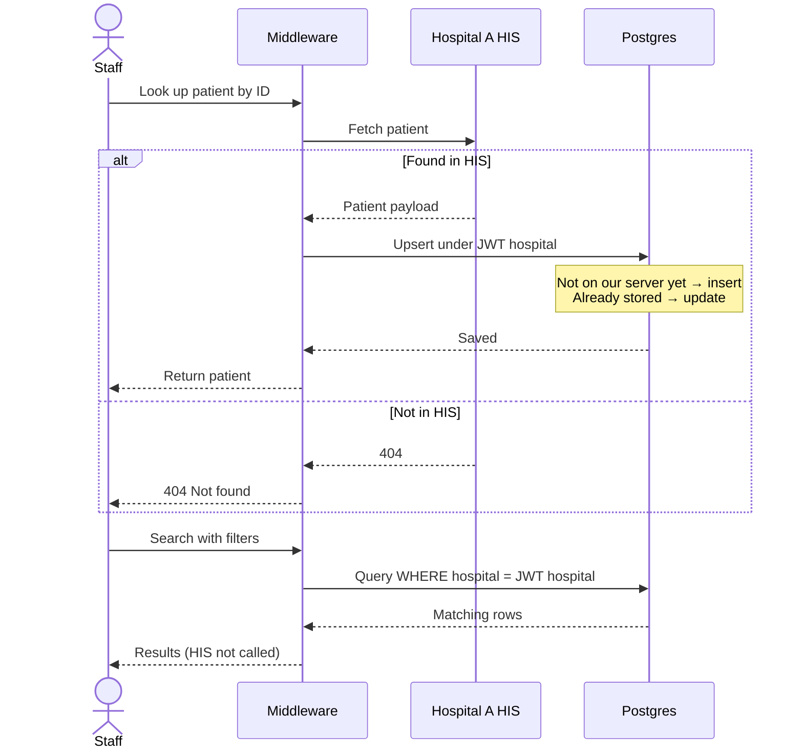
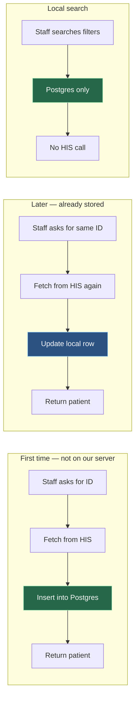
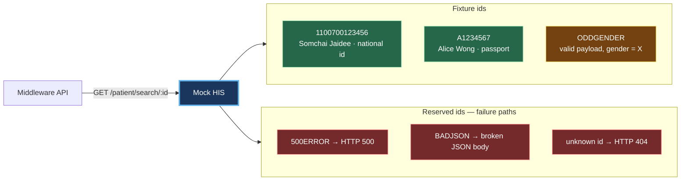

# Hospital Middleware API

Go + Gin hospital middleware for staff authentication and **hospital-scoped** patient search. Patient records are stored in PostgreSQL in a schema compatible with Hospital A HIS, and can be populated via HIS lookup (Compose includes a mock Hospital A upstream for local demos).

**Stack:** Go 1.24 · Gin · PostgreSQL 16 · Nginx · Docker Compose · golang-migrate

**Documentation:** [docs/planning/Documentation.docx](docs/planning/Documentation.docx) — project planning (structure, API spec, ER diagram).

---

## How the patient flow works

Staff authenticate, then work with patients. **Hospital A HIS** (Hospital Information System) is the source of patient data. This API keeps a **local copy** in Postgres, scoped to each staff member's hospital.

The same middleware scales to **Hospital A, B, C, …**. One API, one database — rows are tagged by hospital, and each staff member only sees their own hospital's data (from the JWT, never the request body).



Staff never talk to HIS or Postgres directly. The middleware sits in the middle: authenticate, tag data by hospital, import when needed, and search only within that hospital.

### Hospital isolation (security)

Hospital A staff cannot see Hospital B's patients. The middleware takes the hospital from the **JWT**, adds it to every query, and ignores any hospital field in the request body.



Same rule for Hospital B staff — they only reach `hospital-b` rows. Cross-hospital reads are not possible through the API.

### Fetch from HIS → keep a local copy

When staff look up a patient by ID, the middleware always asks **Hospital A HIS**, then **saves the result in Postgres** under the caller's hospital (upsert: insert if new, update if already stored). After that, **local search** can find the patient without calling HIS again.





1. **Import** — fetch from HIS by ID → upsert locally under the caller's hospital → return.
2. **Search** — read Postgres only (HIS is not called), always limited to that hospital.

Adding another hospital is the same model: register staff with that hospital code; scoping stays automatic.

### Local mock HIS (demo data)

Compose runs `cmd/mockhis` as a stand-in for Hospital A. Lookups by id return canned patients (or forced errors) so demos work offline.



| Id              | What you get                                           |
| --------------- | ------------------------------------------------------ |
| `1100700123456` | Happy-path patient (Thai + English names, national id) |
| `A1234567`      | Happy-path patient (passport id)                       |
| `ODDGENDER`     | 200 OK but `gender` outside `M`/`F` (edge case)        |
| `500ERROR`      | Upstream 500 → API maps to **502**                     |
| `BADJSON`       | Undecodable body → API maps to **502**                 |
| anything else   | HIS 404 → API **404**                                  |

After a successful import, the same patient is in Postgres under the caller's hospital — then **local search** can find it without calling the mock again.

---

## Try the API (Postman)

Step-by-step requests (create staff → login → HIS import → local search, plus negatives) live in Postman:

1. Import [`docs/postman/Patient_Management_System_API.postman_collection.json`](docs/postman/Patient_Management_System_API.postman_collection.json) and [`docs/postman/Local.postman_environment.json`](docs/postman/Local.postman_environment.json)
2. Select the **Local** environment
3. Run the **Demo walkthrough** folder top-to-bottom (login saves `accessToken`)

Details: [docs/postman/README.md](docs/postman/README.md).

---

## Architecture


---

## Design decisions (highlights)

- **Staff and patients are separate modules** — each owns its own logic and database access.
- **Two ways to get patients** — import from HIS by ID, or search what is already saved locally (search never calls HIS).
- **Search uses POST** — so sensitive filters are not stored in URLs or access logs.
- **One access token** — no refresh token; expiry is configurable.
- **Patients are unique per hospital** — same national/passport id can exist at different hospitals.
- **Schema migrations are manual** — applied as their own step, not on every API start.
- **Rate limits at the edge and in the app** — fine for a single instance; use a shared store if you run many replicas.

---

## Project layout

Each feature is a **bounded context** with the same shape. Add Hospital D staff, a new domain, or another HIS adapter without rewriting the core — drop in a parallel package and wire it in `cmd/api` + `httpapi`.

```text
cmd/
  api/                         # composition root — wire contexts + start server
  mockhis/                     # local Hospital A stub

internal/
  staff/                       # bounded context
    domain/                    #   aggregates, VOs, ports
    application/               #   use cases
    infrastructure/postgres/   #   SQL adapter
    transport/http/            #   Gin handlers + DTOs

  patient/                     # bounded context
    domain/
    application/
    infrastructure/
      postgres/                #   SQL adapter
      hospitalA/               #   HIS anti-corruption layer
      # hospitalB/             ← same pattern for another upstream
    transport/http/

  # <next-context>/            ← e.g. appointments: same 4 layers

  shared/                      # small shared kernel (hospital Code, errors, HTTP envelope)
  httpapi/                     # route registration only — no business logic
  middleware/                  # JWT, request id, recovery, rate limit
  config/  platform/           # env, DB pool, logger, infra errors

migrations/                    # versioned SQL (one folder, grows with contexts)
nginx/
docs/
  postman/
```

---

## Quick start

```bash
cp .env.example .env
make up
curl http://localhost:8080/healthz
```

That starts Postgres, migrations, mock HIS, API, and Nginx. Then use [Postman](#try-the-api-postman) to exercise the APIs.

| Port   | Service                   |
| ------ | ------------------------- |
| `8080` | Nginx → API               |
| `8443` | Nginx HTTPS (self-signed) |
| `5432` | Postgres                  |

```bash
make test   # go test ./... -race -cover
make logs
make down
```

See [NGINX.md](NGINX.md) for the edge proxy details.
