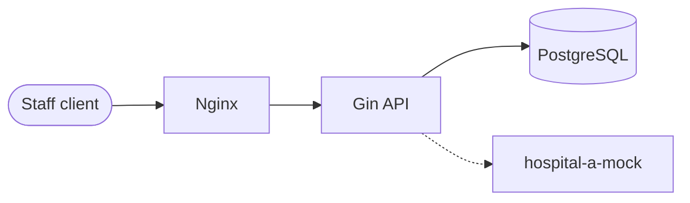

# Hospital Middleware API

Go + Gin hospital middleware for staff authentication and **hospital-scoped** patient search. Patient records are stored in PostgreSQL in a schema compatible with Hospital A HIS, and can be populated via HIS lookup (Compose includes a mock Hospital A upstream for local demos).

**Stack:** Go 1.24 · Gin · PostgreSQL 16 · Nginx · Docker Compose · golang-migrate

---

## Quick start

```bash
cp .env.example .env
make up

# Liveness / readiness (via Nginx)
curl http://localhost:8080/healthz
curl -k https://localhost:8443/healthz

make ps    # container status
make logs  # follow logs
make down  # stop stack
```

`make up` creates the Postgres volume, generates a self-signed TLS cert, runs migrations (one-shot `migrate` service), starts the mock HIS, API, and Nginx.

Local unit tests (no Docker required):

```bash
go test ./... -race -cover
```

| Port | Service |
| ---- | ------- |
| `8080` | Nginx HTTP → Gin API |
| `8443` | Nginx HTTPS (self-signed; generated by `make certs`) |
| `5432` | Postgres (published for local tooling) |

The Gin API and mock HIS have **no host ports** — they are only reachable through Nginx / the Compose network. See [NGINX.md](NGINX.md) for the edge proxy details.

---

## Demo walkthrough

```bash
# 1. Create staff at hospital-a
curl -s http://localhost:8080/staff/create \
  -H 'Content-Type: application/json' \
  -d '{"username":"alice","password":"password12345","hospital":"hospital-a"}'

# 2. Login
TOKEN=$(curl -s http://localhost:8080/staff/login \
  -H 'Content-Type: application/json' \
  -d '{"username":"alice","password":"password12345","hospital":"hospital-a"}' \
  | jq -r '.data.access_token')

# 3. HIS lookup (mock fixture national id) → upserts locally
curl -s http://localhost:8080/patient/search/1100700123456 \
  -H "Authorization: Bearer $TOKEN" | jq

# 4. Local search (hospital-scoped)
curl -s http://localhost:8080/patient/search \
  -H "Authorization: Bearer $TOKEN" \
  -H 'Content-Type: application/json' \
  -d '{"national_id":"1100700123456"}' | jq
```

Mock HIS fixture ids: `1100700123456`, `A1234567`, `ODDGENDER`. Reserved: `500ERROR`, `BADJSON`.

---

## Architecture



| Layer | Responsibility |
| ----- | ---------------- |
| Nginx | TLS, rate limit, header forwarding, reverse proxy |
| Gin handlers | Bind/validate HTTP, map errors to JSON |
| Services | Auth, hospital scope, HIS upsert orchestration |
| Repositories | Parameterized SQL for Staff / Patient |
| `client/hospitala` | Sole HTTP adapter for Hospital A |
| `cmd/mockhis` | Local HIS stub for Compose demos |

**Authorization invariant:** every patient row returned to a caller must belong to the same `hospital` as that caller's JWT claim. Hospital for access control is never taken from the request body.

---

## API surface

| Method | Path | Auth | Purpose |
| ------ | ---- | ---- | ------- |
| `POST` | `/staff/create` | Public | Create staff (`username`, `password`, `hospital`) |
| `POST` | `/staff/login` | Public | Login → JWT (`sub`, `hospital`) |
| `GET` | `/patient/search/:id` | Bearer | HIS lookup → upsert locally → return record |
| `POST` | `/patient/search` | Bearer | Local multi-filter search (hospital-scoped) |
| `GET` | `/healthz` | Public | Liveness |
| `GET` | `/readyz` | Public | Readiness (DB ping) |

Full request/response shapes, error codes, and HIS failure mapping: [docs/planning/02-api-spec.md](docs/planning/02-api-spec.md).

---

## Planning documentation

Assignment deliverables (copy these into the shared Google Doc):

| Deliverable | Repo doc |
| ----------- | -------- |
| Project Structure | [docs/planning/01-project-structure.md](docs/planning/01-project-structure.md) |
| API Spec | [docs/planning/02-api-spec.md](docs/planning/02-api-spec.md) |
| ER Diagram | [docs/planning/03-er-diagram.md](docs/planning/03-er-diagram.md) |

**Google Doc:** _add share link here after you paste/export the planning docs._

Index: [docs/planning/README.md](docs/planning/README.md).

---

## Design decisions (highlights)

- **Two patient endpoints:** HIS lookup (`GET …/:id`) vs local filter search (`POST /patient/search`) — local search never calls HIS.
- **`POST` for filter search** so PII filters stay out of query strings and access logs.
- **Access token only** (no refresh token) — JWT TTL configurable (`JWT_TTL`, default 60m).
- **Upsert key:** `(hospital, national_id)` when present, else `(hospital, passport_id)`.
- **Migrations** run as an explicit one-shot Compose service (never on API boot).
- **Rate limits:** Nginx edge + in-app per-IP login and per-staff patient limits (in-memory; production should use a shared store).

---

## Project layout (short)

```text
cmd/api/           # composition root
cmd/mockhis/       # local Hospital A stub
internal/
  handler/         # HTTP
  service/         # business rules
  repository/      # SQL
  client/hospitala # HIS adapter
  middleware/      # auth, request ID, recovery, rate limit
  config/ platform/
migrations/        # versioned SQL
nginx/             # reverse proxy
docs/planning/     # interviewer-facing planning docs
```

Details: [docs/planning/01-project-structure.md](docs/planning/01-project-structure.md).

---

## Makefile targets

| Target | Purpose |
| ------ | ------- |
| `make up` | Setup + Compose build/start |
| `make down` | Stop stack |
| `make migrate` / `make migrate-down` | Apply / roll back one migration against local Postgres |
| `make test` | `go test ./... -race -cover` |
