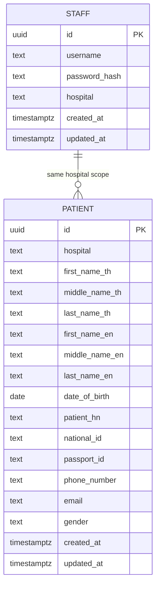

# 3. ER Diagram

Logical data model for Staff and Patient. Timestamps are `TIMESTAMPTZ` (UTC). `date_of_birth` is `DATE`.

## Diagram

> Staff and Patient are not a strict FK parent/child of each other. Both carry a `hospital` **code**. Authorization joins them by matching `patient.hospital` to the staff member's JWT `hospital` claim.

## Staff

| Column | Type | Notes |
| ------ | ---- | ----- |
| `id` | UUID / PK | |
| `username` | TEXT | |
| `password_hash` | TEXT | bcrypt |
| `hospital` | TEXT | lowercase code, e.g. `hospital-a` |
| `created_at` / `updated_at` | TIMESTAMPTZ | UTC |

**Constraints**

- `UNIQUE (username, hospital)` — same username allowed at different hospitals.
- One staff row ↔ exactly one hospital.

## Patient

Aligned with Hospital A HIS fields, plus required `hospital` for scoping.

| Column | Type | Notes |
| ------ | ---- | ----- |
| `id` | UUID / PK | |
| `hospital` | TEXT | **NOT NULL** — scoping key |
| `first_name_th` / `middle_name_th` / `last_name_th` | TEXT | nullable where HIS omits |
| `first_name_en` / `middle_name_en` / `last_name_en` | TEXT | |
| `date_of_birth` | DATE | `YYYY-MM-DD` in JSON |
| `patient_hn` | TEXT | |
| `national_id` | TEXT | nullable |
| `passport_id` | TEXT | nullable |
| `phone_number` / `email` | TEXT | |
| `gender` | TEXT | `M` \| `F` \| NULL |
| `created_at` / `updated_at` | TIMESTAMPTZ | UTC |

**Upsert identity (partial unique indexes)**

- When `national_id` is present: unique on `(hospital, national_id)`.
- Else: unique on `(hospital, passport_id)`.

**Indexes (search performance)**

- `(hospital, national_id)`
- `(hospital, passport_id)`
- `(hospital, last_name_en)`
- `(hospital, date_of_birth)`

Every filter used at scale gets a supporting index in a migration.

## Hospital identifier

`hospital` is a short **code** string shared by Staff, Patient, and JWT — not a free-text display name. Normalized to lowercase on write.

## Export tip for Google Doc

GitHub renders the Mermaid block above. For the Google Doc, either:

1. Paste a screenshot of the rendered diagram, or
2. Recreate in [dbdiagram.io](https://dbdiagram.io) / draw.io and embed the image.
