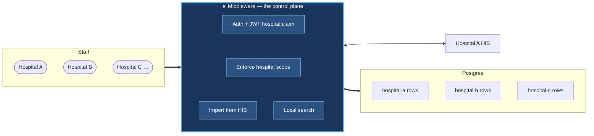
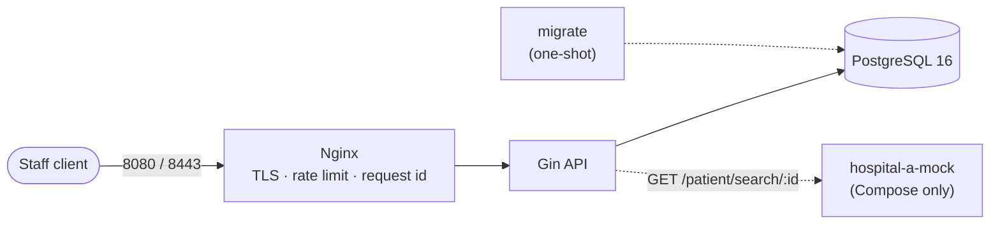
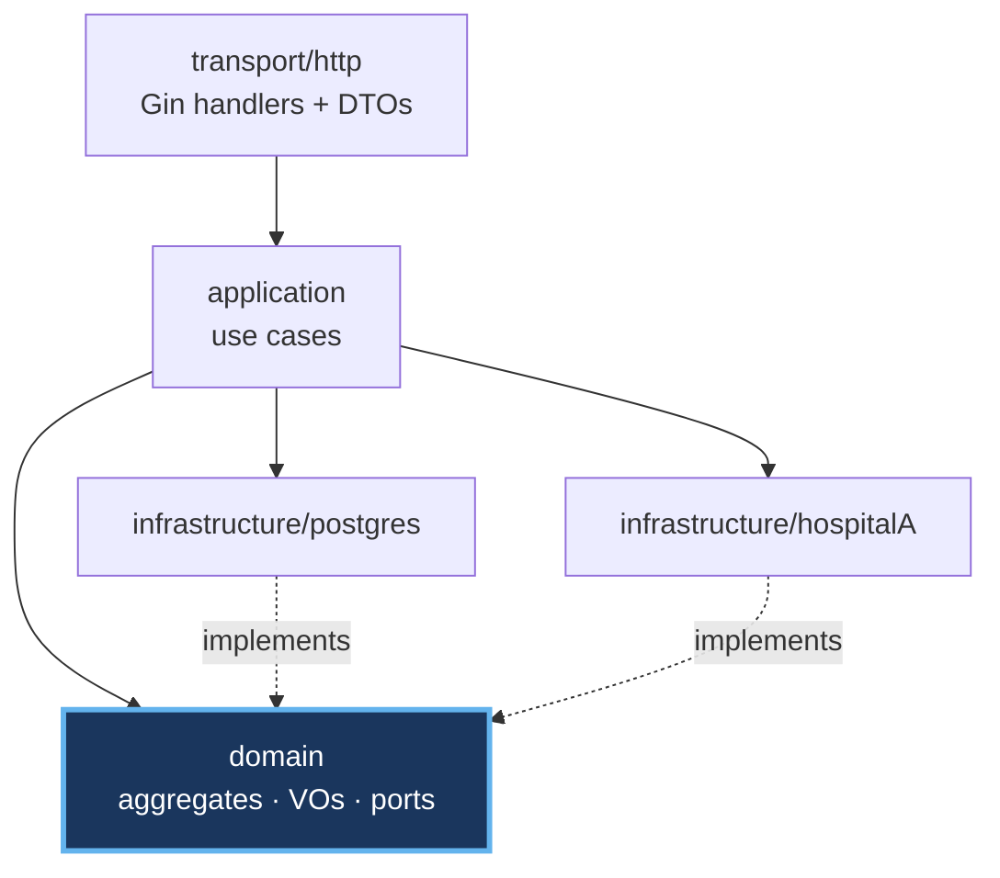
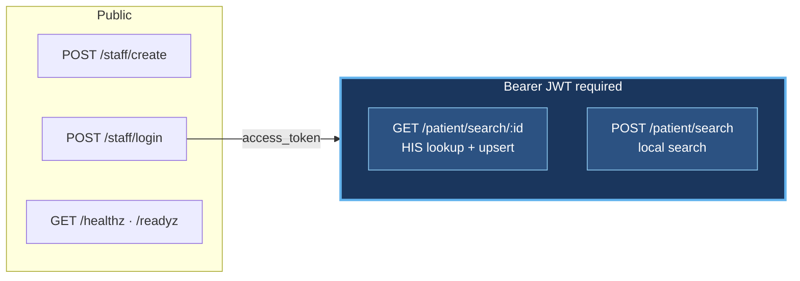
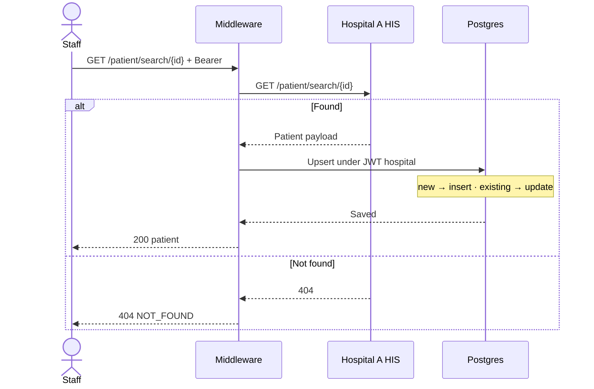
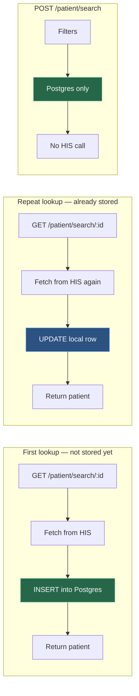
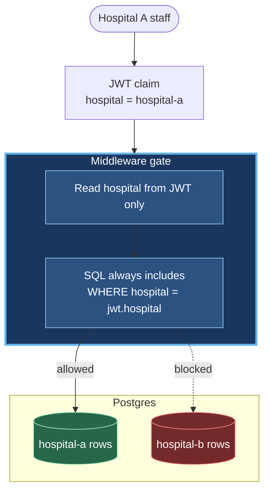
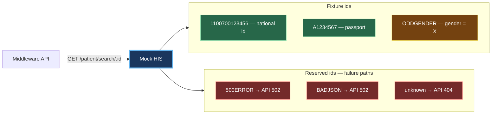
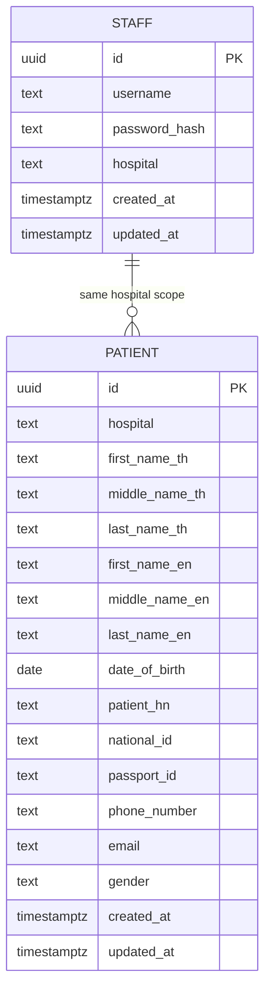
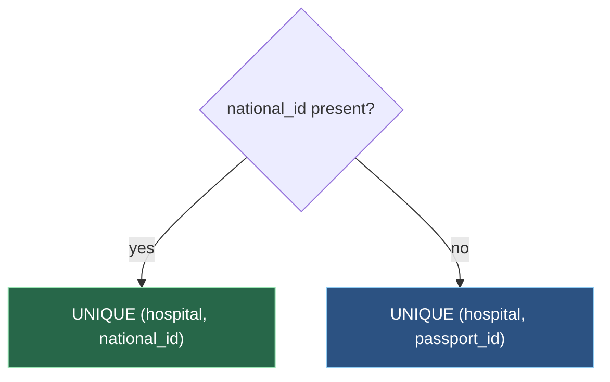

# Hospital Middleware API — Development Planning

Agnos back-end assignment. Three deliverables in one document:

1. [Project Structure](#1-project-structure)
2. [API Spec](#2-api-spec)
3. [ER Diagram](#3-er-diagram)

**Stack:** Go 1.24 · Gin · PostgreSQL 16 · Nginx · Docker Compose · golang-migrate

---

## 0. System overview

Staff authenticate against their own hospital and search patients. Hospital A HIS is the source of patient data; the middleware keeps a local copy in Postgres, tagged by hospital.



Staff never reach HIS or Postgres directly. One API, one database — rows are tagged by hospital.

---

## 1. Project Structure

### 1.1 Runtime topology



Compose runs **nginx + api + postgres + migrate + hospital-a-mock**. Only Nginx is published.

### 1.2 Repository layout

Each feature is a **bounded context** with the same four layers. Adding a hospital, domain, or HIS adapter means dropping in a parallel package and wiring it in `cmd/api` + `httpapi`.

```text
cmd/
  api/main.go                  # composition root — config → DB → HIS client → services → router
  mockhis/main.go              # local Hospital A stub

internal/
  staff/                       # bounded context
    domain/                    #   aggregate, VOs, Repository port
    application/               #   use cases: Create, Login
    infrastructure/postgres/   #   SQL adapter
    transport/http/            #   Gin handler + DTOs

  patient/                     # bounded context
    domain/                    #   aggregate, Gender/LookupID/SearchCriteria VOs, Repository + HISClient ports
    application/               #   use cases: LookupFromHIS, Search
    infrastructure/
      postgres/                #   SQL adapter
      hospitalA/               #   HIS anti-corruption layer
      # hospitalB/             ← same pattern for another upstream
    transport/http/

  # <next-context>/            ← e.g. appointments: same 4 layers

  shared/                      # shared kernel: apperr, hospital.Code, httpkit envelope
  httpapi/                     # route registration + health — no business logic
  middleware/                  # recovery, request id, logger, timeout, JWT, rate limit
  config/  platform/           # env validation, DB pool, slog, JWT

migrations/                    # versioned SQL (.up.sql / .down.sql)
nginx/                         # proxy config + TLS certs
docs/
  planning/                    # this document
  openapi/                     # openapi.yaml (served at /openapi/openapi.yaml)
  postman/                     # collection + environment
docker-compose.yml  Dockerfile  Makefile  .env.example
```

### 1.3 Layering (per bounded context)



Dependencies point inward. `domain` declares the ports; infrastructure implements them, so tests inject fakes.

| Layer | May do | Must not do |
| ----- | ------ | ----------- |
| **transport/http** | Bind/validate, call service, map errors to HTTP | SQL, HIS calls, business rules |
| **application** | Auth rules, hospital scope, upsert orchestration | Import Gin; touch DB drivers directly |
| **infrastructure/postgres** | Parameterized SQL for owned tables | Call HIS; import handlers |
| **infrastructure/hospitalA** | HTTP to HIS, decode into domain types | Leak wire shapes outward |
| **domain** | Aggregates, value objects, ports | Import Gin, SQL drivers, wire types |

### 1.4 Bounded contexts

| Concern | Context | Key rule |
| ------- | ------- | -------- |
| Staff create / login | `internal/staff` | `UNIQUE (username, hospital)` |
| Patient search | `internal/patient` | Always filter by JWT `hospital` |
| HIS lookup | `patient/infrastructure/hospitalA` | Called only from `patient/application` |
| Auth | `internal/middleware` | JWT claims: `sub`, `hospital` |

---

## 2. API Spec

### 2.1 Endpoint map



| Method | Path | Auth | Purpose |
| ------ | ---- | ---- | ------- |
| POST | `/staff/create` | — | Create staff bound to one hospital |
| POST | `/staff/login` | — | Issue access token |
| GET | `/patient/search/:id` | JWT | Fetch from HIS, upsert locally, return |
| POST | `/patient/search` | JWT | Search local records, hospital-scoped |
| GET | `/healthz` | — | Liveness |
| GET | `/readyz` | — | Readiness (pings Postgres) |

Base URL (local): `http://localhost:8080` / `https://localhost:8443`. Live spec: `/openapi/openapi.yaml`, Swagger UI at `/docs/swagger`.

### 2.2 Response envelopes

```jsonc
{ "data": { } }                                   // single
{ "data": [ ], "meta": { "count": 12 } }          // collection
{ "error": { "code": "INVALID_INPUT", "message": "…" } }   // error
```

`message` never contains SQL, stack traces, upstream URLs, or PII.

| Code | HTTP | Use |
| ---- | ---- | --- |
| `INVALID_INPUT` | 400 | Validation failure; empty search filters |
| `UNAUTHORIZED` | 401 | Bad credentials or token |
| `FORBIDDEN` | 403 | Authenticated but not allowed |
| `NOT_FOUND` | 404 | Missing resource; HIS 404 |
| `CONFLICT` | 409 | Duplicate `(username, hospital)` |
| `PAYLOAD_TOO_LARGE` | 413 | Body over 1 MB |
| `RATE_LIMITED` | 429 | Edge or app limit |
| `INTERNAL_ERROR` | 500 | Unexpected |
| `BAD_GATEWAY` | 502 | HIS failure, timeout, decode error |

### 2.3 `POST /staff/create`

```json
{ "username": "alice", "password": "at-least-12-chars", "hospital": "hospital-a" }
```

`201` created (no password hash) · `400` · `409`. Password ≥ 12 chars, bcrypt-hashed; `hospital` normalized lowercase.

### 2.4 `POST /staff/login`

```json
{ "username": "alice", "password": "at-least-12-chars", "hospital": "hospital-a" }
```

```json
{ "data": { "access_token": "<jwt>", "token_type": "Bearer", "expires_in": 3600 } }
```

JWT (HS256) claims: `sub`, `hospital`, `iat`, `exp`. No refresh token — out of scope. Unknown user, wrong hospital, and wrong password all return the same `401` with comparable timing (no enumeration).

### 2.5 `GET /patient/search/:id` — HIS lookup



`id` = national ID or passport ID (alphanumeric, ≤ 64). Responses: `200` · `401` · `404` · `502` (HIS 5xx / timeout / bad JSON) . Upstream bodies are logged, never forwarded.

### 2.6 `POST /patient/search` — local search

All fields optional, **at least one required**. Never calls HIS.

```json
{
  "national_id": "", "passport_id": "",
  "first_name": "", "middle_name": "", "last_name": "",
  "date_of_birth": "1990-01-15",
  "phone_number": "", "email": "",
  "limit": 50, "offset": 0
}
```

`200` `{ "data": [...], "meta": { "count": N } }` · `400` if no filters · `401`.

- **POST, not GET** — filters carry PII; query strings land in access logs and history.
- `limit` default 50, max 200; `offset` default 0.
- A `hospital` field in the body is **ignored** for authorization.
- Patient responses set `Cache-Control: no-store`.

### 2.7 Two distinct patient flows



### 2.8 Hospital isolation



Cross-hospital reads are not reachable through the API.

### 2.9 External: Hospital A HIS

`GET https://hospital-a.api.co.th/patient/search/{id}` → Thai/English names, `date_of_birth`, `patient_hn`, `national_id`, `passport_id`, `phone_number`, `email`, `gender` (`M`/`F`).

Configurable via `HOSPITAL_A_BASE_URL`, `HOSPITAL_A_TIMEOUT`. In Compose it points at `cmd/mockhis` so demos run offline.



### 2.10 Rate limiting

| Layer | Scope | Baseline |
| ----- | ----- | -------- |
| Nginx | Per-IP edge | 10 r/s, burst 20 |
| App | Per-IP on `/staff/login` | 10 / 15 min |
| App | Per-`(username, hospital)` on login | 10 / 15 min |
| App | Per-`staff_id` on `/patient/*` | 60 / min |

App limiters are in-memory — single instance only; multi-replica needs a shared store (deliberate scope boundary).

---

## 3. ER Diagram



Staff and Patient are not an FK parent/child. Both carry a `hospital` **code**; authorization matches `patient.hospital` to the JWT `hospital` claim.

### 3.1 `staff`

| Column | Type | Notes |
| ------ | ---- | ----- |
| `id` | UUID PK | `gen_random_uuid()` |
| `username` | TEXT | |
| `password_hash` | TEXT | bcrypt |
| `hospital` | TEXT | lowercase code, e.g. `hospital-a` |
| `created_at` / `updated_at` | TIMESTAMPTZ | UTC |

`UNIQUE (username, hospital)` — same username may exist at different hospitals; one staff row ↔ one hospital.

### 3.2 `patients`

Mirrors the Hospital A HIS field set, plus the required `hospital` scoping key.

| Column | Type | Notes |
| ------ | ---- | ----- |
| `id` | UUID PK | |
| `hospital` | TEXT NOT NULL | scoping key |
| `first_name_th` / `middle_name_th` / `last_name_th` | TEXT | nullable |
| `first_name_en` / `middle_name_en` / `last_name_en` | TEXT | nullable |
| `date_of_birth` | DATE | `YYYY-MM-DD` in JSON |
| `patient_hn` | TEXT | |
| `national_id` / `passport_id` | TEXT | nullable |
| `phone_number` / `email` | TEXT | |
| `gender` | TEXT | CHECK `M` \| `F` \| NULL |
| `created_at` / `updated_at` | TIMESTAMPTZ | UTC |

### 3.3 Upsert identity



Two partial unique indexes. Same national/passport ID may exist at different hospitals — uniqueness is always per hospital.

### 3.4 Search indexes

Every filter that matters at scale has a supporting index, all prefixed by `hospital`:

`(hospital, national_id)` · `(hospital, passport_id)` · `(hospital, last_name_en)` · `(hospital, date_of_birth)` · `(hospital, lower(first_name_en))` · `(hospital, lower(last_name_en))` · `(hospital, lower(email))` · `(hospital, phone_number)`

---

## 4. Testing

| Scope | Approach |
| ----- | -------- |
| Domain / VOs | Table-driven unit tests |
| Application | Fake `Repository` / `HISClient` ports |
| Transport | `httptest` against the Gin router |
| Repositories | Parameterized SQL against Postgres |

Every behavior ships with a **positive and a negative** case: valid vs. duplicate staff, correct vs. wrong-hospital login, HIS hit vs. 404/500/bad JSON, in-scope vs. cross-hospital search.

```bash
gofmt -w . && go vet ./... && go test ./... -race -cover && govulncheck ./...
```

---

## 5. Design decisions

- **Staff and patients are separate bounded contexts** — each owns its logic and SQL.
- **Two patient flows** — HIS import by ID vs. local search; search never calls HIS.
- **Search uses POST** — PII filters stay out of URLs and logs.
- **One access token**, no refresh; expiry configurable.
- **Patients unique per hospital** — the same ID can exist at two hospitals.
- **Migrations are an explicit step**, not run on app boot.
- **Rate limits at the edge and in the app** — in-memory, single-instance scope.

---

## 6. Running it

```bash
cp .env.example .env
make up
curl http://localhost:8080/healthz
```

| Port | Service |
| ---- | ------- |
| `8080` | Nginx → API |
| `8443` | Nginx HTTPS (self-signed) |
| `5432` | Postgres |

Postman walkthrough (create staff → login → HIS import → local search, plus negatives): `docs/postman/`.
